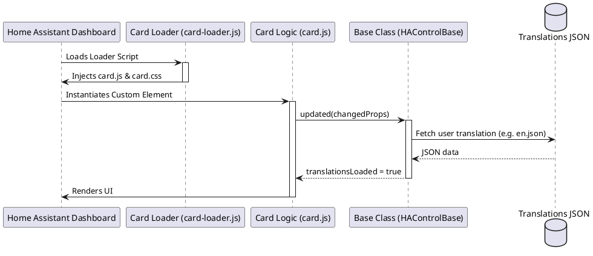

# 🛠️ Development & Architecture Guidelines

This document outlines the coding standards, architectural guidelines, and system patterns required for creating and modifying custom Home Assistant controls in this repository.

---

## 📖 General Guidelines

### 1. Documentation Standard

* Format: All documentation must be written in Markdown (`.md`).
* Diagrams: Any architecture, sequence, or component flow diagrams must be defined using **PlantUML** embedded inside markdown blocks.
* Example PlantUML Sequence:



### 2. Loader Infrastructure Integration

Every custom control must use the unified loader infrastructure provided by [ha-control-loader.js](file:///d:/Ha/ha-controls/ha-control-loader.js).

* Create a `<control-name>-loader.js` script in the control directory.
* This loader handles loading matching CSS/JS files dynamically while managing browser caching with a version string parameter.
* Standard Loader Template:

```javascript
import { HAControlLoader } from "../ha-control-loader.js";

const VERSION = "1.0.0"; // Increment on updates
const SCRIPT_NAME = "example-card-loader.js";

const loader = new HAControlLoader(SCRIPT_NAME, VERSION);
loader.loadModules(
  ["example-card.css", "example-card-editor.css"],
  ["example-card.js", "example-card-editor.js"]
);
```

### 3. Separation of Styling and Logic

To maintain clean codebases and ensure the editor configurators match their presentation components:

* **Logic:** Placed inside `.js` files (e.g. `example-card.js` and `example-card-editor.js`).
* **Styling:** Placed inside `.css` files (e.g. `example-card-editor.css` and `example-card.css`).
* Inject the CSS stylesheet in the `render()` method of the LitElement control or editor:

```javascript
render() {
  return html`
    <link rel="stylesheet" href="/local/ha-controls/example-card/example-card.css?v=${VERSION}">
    <ha-card>
      <!-- HTML Structure here -->
    </ha-card>
  `;
}
```

### 4. Independent Usability

* Each card/control must be **fully self-contained** and independently usable in Lovelace dashboards.
* A control must not depend on another control to be registered in order to load or function correctly.
* If helper entities or custom features (like sub-elements rendered by [feature-renderer-card.js](file:///d:/Ha/ha-controls/feature-renderer-card/feature-renderer-card.js)) are used, the parent card must degrade gracefully (e.g., displaying an error boundary alert or fallback display) if the requested dependency is missing.

### 5. Unified Translation System

All user-facing text strings must support localization using the dynamic translation mechanism.

* Inherit from `HAControlBase` ([ha-control-base.js](file:///d:/Ha/ha-controls/ha-control-base.js)).
* Implement `get translationPath()` returning the path to the language folder.
* Implement `get translationVersion()` to ensure translation cache-busting.
* Never hardcode strings in the template. Use `this._localize('key')` with optional interpolations.

---

## 🏗️ Architectural Guidelines

### 1. Early Return Pattern

Avoid nested conditional blocks (`if-else` stairs) that increase cognitive load and make code harder to debug. Check for failures, empty configurations, or missing states first, and exit the function early.

* ❌ **Bad (Deep Nesting):**

```javascript
render() {
  if (this.hass) {
    if (this.config) {
      const entity = this.hass.states[this.config.entity];
      if (entity) {
        return html`<ha-card>${entity.state}</ha-card>`;
      } else {
        return html`<ha-alert>Entity not found</ha-alert>`;
      }
    }
  }
  return html``;
}
```

* ✔️ **Good (Early Returns):**

```javascript
render() {
  if (!this.hass || !this.config) return html``;
  
  const entity = this.hass.states[this.config.entity];
  if (!entity) {
    return html`<ha-alert>${this._localize('entity_not_found')}</ha-alert>`;
  }

  return html`<ha-card>${entity.state}</ha-card>`;
}
```

### 2. Inheritance for Complexity Reduction

* Avoid duplicating utility functions, lifecycle behaviors, or common dashboard patterns.
* Extend the base framework class `HAControlBase` for all custom cards, editors, and features.
* Let `HAControlBase` automate properties validation, translation setups (`_loadTranslations()`), and localization rendering (`_localize()`).

### 3. Mandatory Multi-Language Support

* Every control must be prepared for multi-language environments.
* All strings presented to the user—including values, units, state descriptions, warnings, and settings labels in visual editor interfaces—must utilize `this._localize('key_name')`.
* Maintain a default English catalog `translations/en.json` containing all keys used by the logic.

---

## 🔍 Extracted Repository Design Patterns

These guidelines represent established conventions and design rules extracted directly from the existing files in this repository.

### 1. Dynamic Version Resolution

All custom cards extract their active query version parameter dynamically. This ensures that when the card or its related resource files (like CSS stylesheets) are fetched, they stay synchronized under browser caching.

* **Pattern:** Access the loader's version from `import.meta.url`.
* **Code Implementation:**

```javascript
const VERSION = new URL(import.meta.url).searchParams.get('v') || '1.0.0';
```

### 2. Style Sheet Ingestion

Stylesheets are loaded dynamically within the card template using `<link>` referencing the resolved version parameter.

* **Pattern:** Reference CSS files with `?v=${VERSION}` query strings.
* **Code Implementation:**

```javascript
render() {
  return html`
    <link rel="stylesheet" href="/local/ha-controls/my-card/my-card.css?v=${VERSION}">
    <ha-card>...</ha-card>
  `;
}
```

### 3. Lovelace Card Picker Registration

To make custom cards visible inside Home Assistant's visual dashboard builder, they must register with the global registries:

* **Custom Cards:** Push a config descriptor to `window.customCards`.
* **Custom Card Features:** Push a configuration descriptor to `window.customCardFeatures`.
* **Card Registry Template:**

```javascript
window.customCards = window.customCards || [];
window.customCards.push({
  type: "my-custom-card",
  name: "My Custom Card",
  description: "Brief user-facing description",
  preview: true
});
```

### 4. Configuration Validation

Lovelace calls `setConfig(config)` when parsing dashboard YAML. Cards must validate required configurations and merge fallback defaults.

* **Pattern:** Throw plain errors for missing values and set fallback configurations.
* **Code Implementation:**

```javascript
setConfig(config) {
  if (!config.entity) {
    throw new Error("You must configure an entity");
  }
  this.config = {
    layout: 'row',
    show_icon: true,
    ...config
  };
}
```

### 5. Translation Directory Structure

Dynamic translation loading requires placing localizations inside the card's subdirectory.

* **Pattern:** Set `translationPath` matching `/local/ha-controls/<card-folder>/translations`.
* **Code Implementation:**

```javascript
get translationPath() {
  return "/local/ha-controls/my-custom-card/translations";
}
```

---

## 💡 Recommended Best Practices

### 1. JavaScript & LitElement Performance

* **Optimize `shouldUpdate`:** Home Assistant updates the global `hass` object whenever *any* entity in the system changes state. Implement `shouldUpdate` to only return `true` if the specific entities or config options referenced in your control have changed state or values.
* **Cleanup Listeners:** Unbind any global window, document, or custom DOM event listeners inside `disconnectedCallback()` to avoid memory leaks.
* **Leverage Native Actions:** Route user interactions (clicks, long-presses) using Home Assistant's native action router (dispatching a custom `hass-action` event) to support Lovelace's native action configurations.

### 2. CSS & Dashboard Styling

* **Design Tokens (CSS Variables):** Never hardcode absolute color values (hex/rgb) for backgrounds, text, borders, or hover overlays. Always use standard Home Assistant CSS variables (e.g. `var(--primary-color)`, `var(--card-background-color)`) so cards match the active user theme.
* **Performant Animations:** Limit dynamic visual effects (like pulsing badges) to GPU-accelerated CSS properties (`opacity`, `transform`) rather than properties that trigger layout thrashing (`width`, `height`, `margin`).
* **Outer containment:** Always set visual margins and wrapper layout parameters within `:host` rules to integrate cleanly with dashboard grid structures.

### 3. Home Assistant API Integration

* **Use Localized Formatters:** Avoid rendering raw timestamps or float values. Utilize Home Assistant's integrated formatting helpers (e.g., `this.hass.formatEntityState(stateObj)`) to display values matching the user's regional format settings.
* **Lovelace Config Editors:** Always provide a visual configuration editor for your cards to support user-friendly customization via the dashboard visual builder.
* **Graceful Degradation:** Display clear `<ha-alert>` warnings when a configured entity is missing, unavailable, or misconfigured, preventing JS stack failures.
