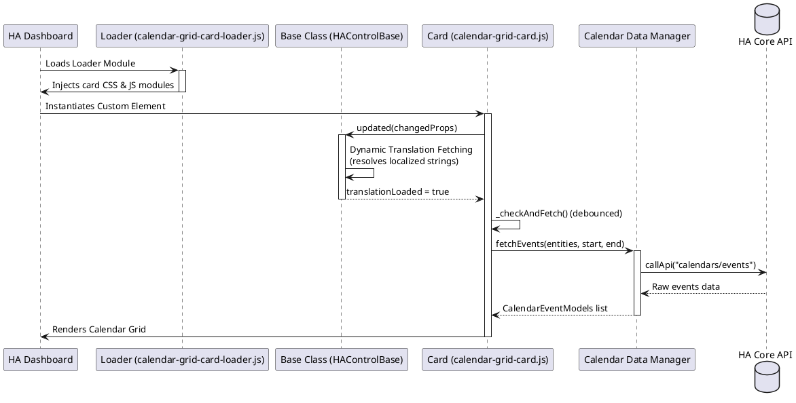

# 📅 Calendar Grid Card

The `calendar-grid-card` displays events from multiple Home Assistant calendars in a clean monthly or weekly grid. It provides timezone-aware calculations, filter toggles, a sidebar calendar selector, custom day names, and state-persistent exclusions saved in the browser's local storage.

---

## ⚙️ Configuration Schema

Below is the complete configuration schema for the card. Define these fields in your Lovelace dashboard YAML block:

### Main Card Settings

| Property | Type | Required | Default | Description |
| :--- | :--- | :--- | :--- | :--- |
| `type` | string | **Yes** | — | Must be `custom:calendar-grid-card`. |
| `entities` | array | **Yes** | — | Array list of calendars to load. Can be plain strings (entity IDs) or detailed objects. See [Entity Options](#entity-options). |
| `default_view` | string | No | `month` | The default calendar layout view. Supported values: `month`, `week`. |
| `first_day_of_week` | number | No | `1` | Day index to start the week. Supported values: `0` (Sunday), `1` (Monday), ..., `6` (Saturday). |
| `orientation` | string | No | `horizontal` | Grid layout rendering direction. Supported values: `horizontal` (standard rows), `vertical` (columns). |
| `day_names` | string/array | No | Localized | Names of week day columns. Can be an array of 7 short strings or a single comma-separated string (e.g. `Sun,Mon,Tue,Wed,Thu,Fri,Sat`). |
| `today_background` | string | No | — | CSS background string applied to today's date grid cell (e.g., `rgba(3, 169, 244, 0.12)` or `var(--primary-color)`). |
| `today_border` | string | No | — | CSS border definition style applied to today's date grid cell (e.g., `2px solid var(--accent-color)`). |
| `show_finished_events`| boolean | No | `true` | When set to `false`, events that have already ended will be filtered out and hidden. |
| `show_refresh_button` | boolean | No | `true` | Displays a reload icon button in the header bar. |
| `sidebar_position` | string | No | `right` | Position of the list visibility toggle panel. Supported values: `right`, `left`, `top`, `bottom`, `hidden`. |
| `event_features` | array | No | Default list | List of features displayed in the event details popup dialog. Supported: `time`, `location`, `description`, `attendees`. |
| `month_start` | string | No | — | Setting to `today` enables a rolling monthly calendar grid view that starts on the week of the current system date rather than the first day of the calendar month. |
| `rolling_month` | boolean | No | `false` | Enables a rolling 30-day view window. |
| `day_tap_action` | object | No | `{ "action": "popup" }` | Action to perform when clicking on a day cell. Supported actions: `popup` (opens detailed overlay popups for that day), standard Lovelace actions (e.g. `navigate`, `call-service`, `url`, `none`). |
| `popup_config` | object | No | — | Optional calendar-list-card configuration parameters passed directly to the popup list card generated on day clicks (e.g. `{ "show_due_date": false, "show_source": false }`). |

---

### Entity Options

When listing calendar sources, you can provide advanced configurations for each calendar by specifying it as an object:

| Property | Type | Required | Default | Description |
| :--- | :--- | :--- | :--- | :--- |
| `entity` | string | **Yes** | — | The entity ID of the target calendar (e.g., `calendar.personal_schedule`). |
| `name` | string | No | Friendly Name | Custom label display override for the calendar toggles inside the sidebar. |
| `color` | string | No | — | Custom text/foreground color code (hex/rgb/css variable) applied to this calendar's toggle pill in the sidebar. |
| `backgroundColor` | string | No | — | Custom background color applied to the calendar's sidebar toggle pill. |
| `iconColor` | string | No | — | Custom color code applied to the calendar event icon. |
| `activeColor` | string | No | — | Text/foreground color override for event labels when active. |
| `activeBackgroundColor`| string | No | — | Background color override for active event cells. |
| `activeIconAnimation` | string | No | — | Icon animation type class when active. Supported: `spinning`, `pulsing`. |
| `filters` | array | No | — | List of filter regex pattern objects to exclude specific events. See [Filter Options](#filter-options). |

#### Filter Options

Allows excluding events matching custom regular expressions:

| Property | Type | Required | Default | Description |
| :--- | :--- | :--- | :--- | :--- |
| `pattern` | string | **Yes** | — | The regular expression pattern to match against event titles. |
| `case_sensitive` | boolean | No | `true` | Performs case-sensitive matching if set to `true`. |

---

## 💡 YAML Configuration Example

```yaml
type: custom:calendar-grid-card
default_view: month
first_day_of_week: 1
orientation: horizontal
sidebar_position: right
today_background: "rgba(3, 169, 244, 0.15)"
today_border: "2px solid var(--accent-color)"
entities:
  - entity: calendar.work_schedule
    name: "Work Calendar"
    color: "#ff5722"
    backgroundColor: "rgba(255, 87, 34, 0.2)"
    filters:
      - pattern: "^Lunch Break"
        case_sensitive: false
  - entity: calendar.personal_reminders
    name: "Personal"
    color: "#4caf50"
    backgroundColor: "rgba(76, 175, 80, 0.2)"
    activeIconAnimation: pulsing
```

---

## 🏗️ Architecture & Interaction Flow

The interaction sequence for loader fetching, dynamic translations resolution, and event loading lifecycle is described below:


