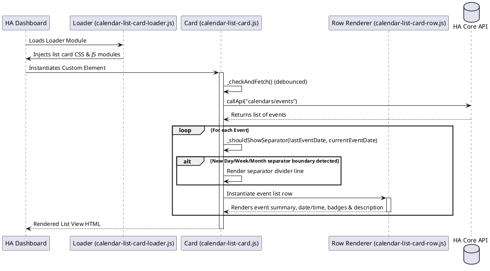

# 📅 Calendar List Card

The `calendar-list-card` displays events from multiple Home Assistant calendars in a clean, vertical chronological list. It features relative time calculations (e.g. "In 3 days"), smart boundary grouping headers, event descriptions rendering, search filter toggles, custom separators styling, threshold-based date coloring, and child features rendering.

---

## ⚙️ Configuration Schema

Below is the complete configuration schema for the card. Define these fields in your Lovelace dashboard YAML block:

### Main Card Settings

| Property | Type | Required | Default | Description |
| :--- | :--- | :--- | :--- | :--- |
| `type` | string | **Yes** | — | Must be `custom:calendar-list-card`. |
| `entities` | array | **Yes** | — | Array list of calendars to load. Can be plain strings (entity IDs) or detailed objects. See [Entity Options](#entity-options). |
| `title` | string | No | — | Optional card title text shown in the header. |
| `icon` | string | No | `mdi:calendar-multiselect` | Icon shown in the card header. |
| `max_days` | number | No | `7` | Maximum number of days in the future to search for events. |
| `max_items` | number | No | — | Maximum total number of events to show in the list. |
| `show_refresh_button` | boolean | No | `false` | Displays a refresh icon button in the header bar. |
| `show_finished_events` | boolean | No | `true` | When set to `false`, events that have already ended will be hidden. |
| `show_due_date` | boolean | No | `true` | Displays the start date of each event. |
| `show_description` | boolean | No | `false` | Displays the event description text (if available). |
| `show_due_in_days` | boolean | No | `true` | Displays the relative day count (e.g. "Tomorrow", "In 5 days"). |
| `show_source` | boolean | No | `false` | Displays the source calendar friendly name badge. |
| `default_due_date_color` | string | No | — | Custom default CSS color code for the event dates. |
| `date_separator_color` | string | No | `transparent` | CSS color code for separators between consecutive dates. |
| `day_separator_color` | string | No | — | CSS color code for visual separator lines. |
| `due_in_days_separator_color` | string | No | — | CSS color code for separators before relative days. |
| `source_color` | string | No | — | CSS color code for the source calendar text labels. |
| `separator_mode` | string | No | `day` | Grouping boundary mode for rendering separators. Supported: `day` (separator on new day), `week` (on new week), `month` (on new month). |
| `due_date_colors` | array | No | — | List of threshold rules for dynamic date coloring. See [Date Color Thresholds](#date-color-thresholds). |
| `features` | array | No | — | List of child custom features rendered within each event row. |

---

### Entity Options

When listing calendar sources, you can provide advanced configurations for each calendar by specifying it as an object:

| Property | Type | Required | Default | Description |
| :--- | :--- | :--- | :--- | :--- |
| `entity` | string | **Yes** | — | The entity ID of the target calendar (e.g. `calendar.personal_schedule`). |
| `filters` | array | No | — | List of filter regex pattern objects to exclude specific events. See [Filter Options](#filter-options). |

#### Filter Options

Allows excluding events matching custom regular expressions:

| Property | Type | Required | Default | Description |
| :--- | :--- | :--- | :--- | :--- |
| `pattern` | string | **Yes** | — | The regular expression pattern to match against event titles. |
| `case_sensitive` | boolean | No | `true` | Performs case-sensitive matching if set to `true`. |

---

## 🚦 Date Color Thresholds

You can customize the event date text color dynamically based on how many days are remaining until the event. Rules are evaluated in order from top to bottom:

| Property | Type | Required | Default | Description |
| :--- | :--- | :--- | :--- | :--- |
| `operator` | string | **Yes** | `<=` | Comparison operator. Supported: `=`, `<>`, `<`, `<=`, `>`, `>=`. |
| `days` | number | **Yes** | — | Number of days to compare against. |
| `color` | string | **Yes** | — | CSS color code to apply when this threshold matches. |

---

## 💡 YAML Configuration Example

```yaml
type: custom:calendar-list-card
title: "Upcoming Schedule"
icon: mdi:calendar-clock
max_days: 14
max_items: 10
show_description: true
show_source: true
separator_mode: day
entities:
  - entity: calendar.work_schedule
    filters:
      - pattern: "^Lunch Break"
        case_sensitive: false
  - entity: calendar.personal_reminders
due_date_colors:
  - operator: "<="
    days: 0
    color: "var(--error-color)" # Today's events show in red
  - operator: "<="
    days: 1
    color: "var(--warning-color)" # Tomorrow's events show in yellow
features:
  - type: "custom:calendar-property-feature"
    property: "time"
```

---

## 🏗️ Architecture & Interaction Flow

The interaction sequence for calendar list event rendering and boundary calculations:


