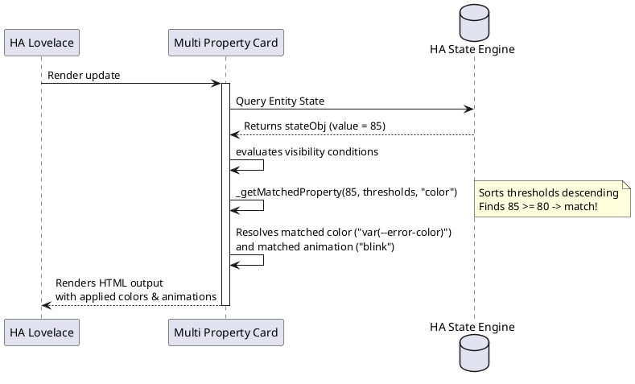

# 📊 Multi Property Card

The `multi-property-card` renders a grid layout of entity parameters. It supports dynamic value formats, custom threshold color-mapping (supporting strings or numeric ranges), fallback icon resolution, conditional visibility expression rules, actions execution, and nested custom features.

---

## ⚙️ Configuration Schema

Below is the complete configuration schema for the card. Define these fields in your Lovelace dashboard YAML block:

### Main Card Settings

| Property | Type | Required | Default | Description |
| :--- | :--- | :--- | :--- | :--- |
| `type` | string | **Yes** | — | Must be `custom:multi-property-card`. |
| `entities` | array | **Yes** | — | Array list of entity items or constants to display. See [Entity Grid Settings](#entity-grid-settings). |
| `layout` | string | No | `row` | Layout grid orientation. Supported values: `row` (horizontal), `column` (vertical). |
| `show_label` | boolean | No | `true` | Default visibility toggle for labels. |
| `show_value` | boolean | No | `true` | Default visibility toggle for values. |
| `show_icon` | boolean | No | `true` | Default visibility toggle for icons. |
| `show_unavailable` | boolean | No | `false` | When set to `false`, hides a property tile if its value is missing, unknown, or unavailable. |

---

### Entity Grid Settings

Each property card cell in the `entities` array is configured as follows:

| Property | Type | Required | Default | Description |
| :--- | :--- | :--- | :--- | :--- |
| `entity` | string | No* | — | Target entity ID to read value from (e.g. `sensor.power_consumption`). Optional if a static `value` is provided. |
| `attribute` | string | No | — | Optional attribute key to fetch and display instead of the main state (e.g. `battery_level`). |
| `value` | string/num | No | — | Hardcoded static value string to render (ignores entity state). |
| `name` | string | No | Friendly Name | Custom label display override. |
| `icon` | string | No | Fallback | Custom icon override (e.g. `mdi:solar-panel`). Resolves to standard fallbacks depending on entity domain/device class if empty. |
| `unit` | string | No | UoM | Custom unit suffix string displayed after value (e.g., `W` or `%`). |
| `color` | string | No | `var(--primary-text-color)` | Default text and icon color. |
| `animation` | string | No | — | Default icon animation. Supported values: `blink`, `bounce`, `rotating`, `pulse`, `shake`, `float`, `spin_slow`. |
| `label_font_size`| string/num | No | — | Typography sizing styling override (e.g. `12px` or `0.85rem`). |
| `label_bold` | boolean | No | `false` | Applies bold styling weight to the description label. |
| `show_label` | boolean | No | Global value | Override card-wide label visibility switch. |
| `show_value` | boolean | No | Global value | Override card-wide value visibility switch. |
| `show_icon` | boolean | No | Global value | Override card-wide icon visibility switch. |
| `condition` | string | No | — | JavaScript visibility expression. Hidden if it evaluates to `false`. See [Conditional Visibility](#conditional-visibility). |
| `tap_action` | object | No | — | Lovelace tap action configuration. |
| `hold_action` | object | No | — | Lovelace hold action configuration. |
| `thresholds` | array | No | — | Array list of threshold objects for dynamic color/animation. See [Threshold Rules](#threshold-rules). |
| `features` | array | No | — | List of child custom features rendered within the button tile. |

*\*Note: Either `entity` or `value` must be defined.*

#### Conditional Visibility

If a property has a `condition` string, it is dynamically evaluated using Javascript on state updates:
* Context variables available: `hass` (HA object), `entity` (state object of the current entity), `state` (shortcut to `entity.state`), and `attributes` (shortcut to `entity.attributes`).
* *Example:* `condition: "state > 0"` or `condition: "attributes.status === 'active'"`.

---

## 🚦 Threshold Rules

Thresholds allow you to dynamically alter colors and animations depending on active state values. They are defined inside a `thresholds` array under each entity, and evaluated in order from top to bottom:

| Property | Type | Required | Default | Description |
| :--- | :--- | :--- | :--- | :--- |
| `value` | string/num | **Yes** | — | Comparison value. Matches strings exactly (case-insensitive) or checks numbers if state `>= value`. |
| `color` | string | No | — | Custom color applied when threshold matches. |
| `animation` | string | No | — | Icon animation applied when threshold matches. Supported: `blink`, `bounce`, `rotating`, `pulse`, `shake`, `float`, `spin_slow`. |

---

## 💡 YAML Configuration Example

```yaml
type: custom:multi-property-card
layout: row
show_label: true
show_value: true
entities:
  - entity: sensor.solar_power
    name: "Solar Generation"
    color: "#ffc107"
    unit: "kW"
    thresholds:
      - value: 5.0
        color: "#ffeb3b"
        animation: pulse
  - entity: sensor.battery_status
    name: "Storage Battery"
    attribute: battery_level
    unit: "%"
    thresholds:
      - value: 20
        color: "var(--error-color)"
        animation: blink
      - value: 100
        color: "var(--success-color)"
```

---

## 🏗️ Architecture & Rendering Flow

Threshold evaluation flow inside `MultiPropertyCard`:


