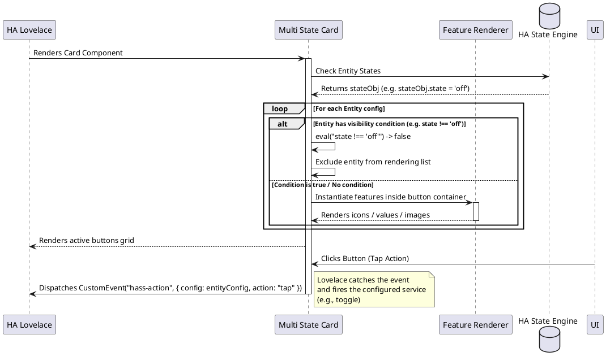

# 🔘 Multi State Card

The `multi-state-card` displays an interactive grid of button tiles representing different entities. It doesn't enforce standard controls; instead, the contents and animations of each button are entirely built and styled using custom card features. It supports conditional visibility filters using JavaScript expressions and routes native Lovelace actions.

---

## ⚙️ Configuration Schema

Below are the configuration parameters for the card. Define these fields in your Lovelace dashboard YAML block:

### Main Card Settings

| Property | Type | Required | Default | Description |
| :--- | :--- | :--- | :--- | :--- |
| `type` | string | **Yes** | — | Must be `custom:multi-state-card`. |
| `entities` | array | **Yes** | — | Array list of entity items to render. See [Entity Button Options](#entity-button-options). |
| `layout` | string | No | `row` | Layout grid orientation. Supported values: `row` (horizontal grid), `column` (vertical stack). |
| `show_unavailable` | boolean | No | `false` | When set to `false`, entity buttons will be skipped/hidden if the underlying entity is missing, unknown, or unavailable. |

---

### Entity Button Options

Each button tile inside the `entities` array is configured as follows:

| Property | Type | Required | Default | Description |
| :--- | :--- | :--- | :--- | :--- |
| `entity` | string | **Yes** | — | Target entity ID to monitor and associate with this button (e.g. `switch.hallway_light`). |
| `condition` | string | No | — | JavaScript visibility expression. If it evaluates to `false`, the button is hidden. See [Conditional Visibility](#conditional-visibility). |
| `disabled_expression` | string | No | — | JavaScript expression. If it evaluates to `true`, the button interaction is disabled and opacity is lowered. |
| `state_animations` | object | No | — | Map of entity state values to animation classes (e.g., `locking: rotating`). |
| `tap_action` | object | No | — | Lovelace tap action configuration (e.g., toggle, more-info, call-service). |
| `hold_action` | object | No | — | Lovelace long-press action configuration. |
| `features` | array | No | — | Nested array of child card feature configurations (like icons, texts, or timers) rendered inside the button. |

#### Conditional Visibility

If a button has a `condition` string, it is dynamically evaluated on state updates using Javascript:
* If the expression evaluates to `false`, the button is hidden.
* **Context variables** available in the expression scope:
  * `hass`: The global Home Assistant object.
  * `entity`: The state object of the button's entity.
  * `state`: Short-hand for `entity.state`.
  * `attributes`: Short-hand for `entity.attributes`.
* *Example:* `condition: "state === 'on'"` or `condition: "attributes.current_consumption > 100"`.

---

## 💡 YAML Configuration Example

```yaml
type: custom:multi-state-card
layout: row
show_unavailable: false
entities:
  - entity: light.kitchen_ceiling
    tap_action:
      action: toggle
    hold_action:
      action: more-info
    features:
      - type: "custom:icon-card-feature"
        icon: mdi:ceiling-light
      - type: "custom:state-value-feature"
  - entity: binary_sensor.front_door_contact
    condition: "state === 'on'" # Only show button when the door is open
    tap_action:
      action: more-info
    features:
      - type: "custom:icon-card-feature"
        icon: mdi:door-open
        animation: flash
```

---

## 🏗️ Architecture & Interaction Flow

The interaction sequence for action execution and condition evaluation in Multi State Card:


