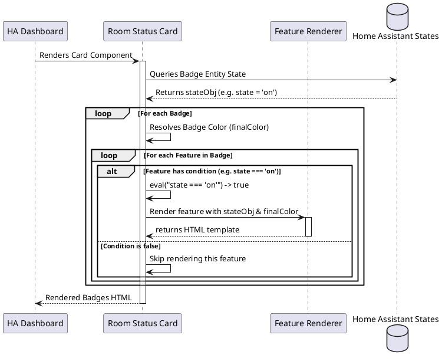

# 🏠 Room Status Card

`room-status-card` displays room status indicators in a compact, horizontal row of status badges. Each badge displays properties of a referenced entity (such as temperature, humidity, or motion) populated using nested custom card features with conditional rendering logic.

---

## ⚙️ Configuration Schema

Below are the configuration parameters for the card. Define these fields in your Lovelace dashboard YAML block:

### Main Card Settings

| Property | Type | Required | Default | Description |
| :--- | :--- | :--- | :--- | :--- |
| `type` | string | **Yes** | — | Must be `custom:room-status-card`. |
| `name` | string | No | `Room` | The display name of the room printed in the card header. |
| `icon` | string | No | `mdi:home` | Header icon to represent the room. |
| `header_settings`| object | No | — | Visibility options for header elements. See [Header Settings](#header-settings). |
| `badges` | array | No | `[]` | List of status badges to align horizontally. See [Badge Settings](#badge-settings). |

### Header Settings

| Property | Type | Required | Default | Description |
| :--- | :--- | :--- | :--- | :--- |
| `show_header` | boolean | No | `true` | Display the room name text in the header. |
| `show_icon` | boolean | No | `true` | Display the room icon in the header. |
| `heading_style`| string  | No | `title`| The heading style and size. Options: `title` (default, standard card title size) or `subtitle` (smaller subtitle size). |

---

### Badge Settings

Each entry in the `badges` array is structured as follows:

| Property | Type | Required | Default | Description |
| :--- | :--- | :--- | :--- | :--- |
| `entity` | string | No | — | Entity ID associated with this badge (e.g. `sensor.bedroom_temperature`). It serves as the default state provider for child features. |
| `color` | string | No | `var(--primary-text-color)` | Color code or CSS variable applied to the badge elements and inherited by child features. |
| `features` | array | No | — | Array list of child custom feature configurations (like icons or state values) to render inside this badge cell. |

#### Conditional Feature Rendering

All nested feature configuration objects can include a `condition` string. This string contains a JavaScript expression evaluated dynamically when state updates occur:
* If the expression evaluates to `false`, the feature is not rendered.
* **Context variables** available in the expression scope:
  * `hass`: The global Home Assistant object.
  * `entity`: The state object of the badge entity.
  * `state`: Short-hand for `entity.state`.
  * `attributes`: Short-hand for `entity.attributes`.
* *Example:* `condition: "state === 'on'"` or `condition: "parseFloat(state) > 22.5"`.

---

## 💡 YAML Configuration Example

```yaml
type: custom:room-status-card
name: "Master Bedroom"
icon: mdi:bed
header_settings:
  show_header: true
  show_icon: true
badges:
  - entity: sensor.bedroom_temperature
    color: "var(--primary-text-color)"
    features:
      - type: "custom:icon-card-feature"
        icon: mdi:thermometer
      - type: "custom:state-value-feature"
  - entity: binary_sensor.bedroom_motion
    color: "var(--warning-color)"
    features:
      - type: "custom:icon-card-feature"
        icon: mdi:motion-sensor
        animation: pulsing
        condition: "state === 'on'"
```

---

## 🏗️ Architecture & Interaction Flow

The interaction and conditional rendering sequence for room status badges:


