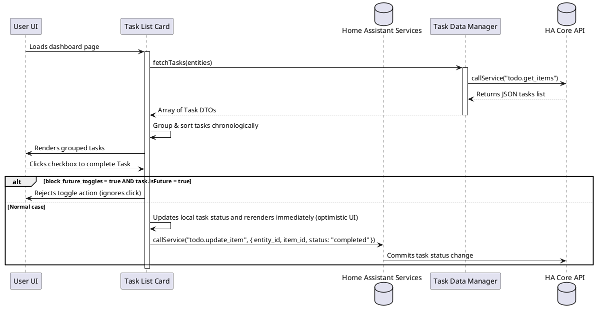

# 📝 Task List Card

The `task-list-card` compiles and displays tasks from Home Assistant `todo` list entities. It includes support for sourcing tasks from multiple lists, due-date grouping separators (day/week/month), relative due indicators, and block toggling parameters to prevent check-off of future tasks.

---

## ⚙️ Configuration Schema

Below are the configuration parameters for the card. Define these fields in your Lovelace dashboard YAML block:

### Main Card Settings

| Property | Type | Required | Default | Description |
| :--- | :--- | :--- | :--- | :--- |
| `type` | string | **Yes** | — | Must be `custom:task-list-card`. |
| `entity` | string | Yes* | — | Single `todo` entity ID to display tasks from (e.g. `todo.shopping_list`). |
| `entities` | array | Yes* | — | List of `todo` entity IDs. Can be plain strings or objects. See [Entity List Items](#entity-list-items). |
| `title` | string | No | — | Custom header card title. |
| `icon` | string | No | `mdi:calendar-check` | Custom header card icon. |
| `max_days` | number | No | — | Cut-off day range. Hides tasks scheduled beyond this number of days in the future. |
| `show_no_due_date` | boolean | No | `true` | When set to `false`, tasks that don't have a due date are hidden. |
| `show_completed` | boolean | No | `true` | When set to `false`, tasks marked as completed are hidden. |
| `show_due_date` | boolean | No | `true` | Display the absolute due date string under the task label. |
| `show_description` | boolean | No | `false` | Display task description metadata beneath the title. |
| `show_due_in_days` | boolean | No | `false` | Display relative due countdown labels (e.g., "Due in 3 days", "Overdue by 1 day"). |
| `show_refresh_button` | boolean | No | `false` | Displays a reload trigger button at the bottom of the card. |
| `show_delete_completed_button`| boolean | No | `false` | Displays a bulk sweep button at the bottom to clean up all completed tasks. |
| `show_source` | boolean | No | `false` | Displays the friendly name of the source list when multiple entities are loaded. |
| `merge_tasks_same_day`| boolean | No | `false` | Groups multiple tasks due on the exact same date under a single header segment. |
| `block_future_toggles`| boolean | No | `true` | If set to `true`, checkbox clicking is ignored for tasks scheduled ahead of the current day. |
| `separator_mode` | string | No | `day` | Grouping division mode for headers/lines. Supported values: `day`, `week`, `month`. |
| `day_separator_color` | string | No | — | CSS color applied to the horizontal dividing lines between day groups. |
| `date_separator_color`| string | No | `transparent` | Color of separator header labels. |
| `source_color` | string | No | — | Text color code applied to source list indicators. |
| `merged_tasks_separator_color`| string | No | `var(--divider-color)`| Color of the thin line separating merged tasks of the same day. |
| `due_date_colors` | array | No | — | Array of conditional rules to colorize task labels based on due date ranges. See [Due Date Color Rules](#due-date-color-rules). |

*\*Note: Either `entity` or `entities` must be defined.*

---

### Entity List Items

When specifying the `entities` array list, elements can be detailed objects:

| Property | Type | Required | Default | Description |
| :--- | :--- | :--- | :--- | :--- |
| `entity` | string | **Yes** | — | Target `todo` entity ID. |
| `filters` | array | No | — | List of filter regex patterns. Matches against task summary text. |
| `pattern` | string | **Yes** (inside filter) | — | Regex pattern string. |
| `case_sensitive` | boolean | No | `true` | Execute case-sensitive matches. |

---

### Due Date Color Rules

Color rules are defined in the `due_date_colors` array to format task layouts based on relative due values:

| Property | Type | Required | Default | Description |
| :--- | :--- | :--- | :--- | :--- |
| `operator` | string | **Yes** | `<=` | Comparison operator. Supported: `=`, `<>`, `<`, `<=`, `>`, `>=`. |
| `days` | number | **Yes** | — | Number of offset days relative to current time to check. |
| `color` | string | **Yes** | — | Color code applied to text if comparison evaluates to `true` (e.g. `var(--error-color)`). |

---

## 💡 YAML Configuration Example

```yaml
type: custom:task-list-card
title: "Upcoming Chores"
icon: mdi:broom
max_days: 7
show_completed: false
show_due_in_days: true
show_delete_completed_button: true
show_refresh_button: true
separator_mode: week
day_separator_color: "var(--accent-color)"
entities:
  - entity: todo.household_tasks
  - entity: todo.garden_tasks
due_date_colors:
  - operator: "<="
    days: 0
    color: "var(--error-color)"
  - operator: "<="
    days: 2
    color: "var(--warning-color)"
```

---

## 🏗️ Architecture & Interaction Flow

The interaction sequence for listing and checking off tasks:


