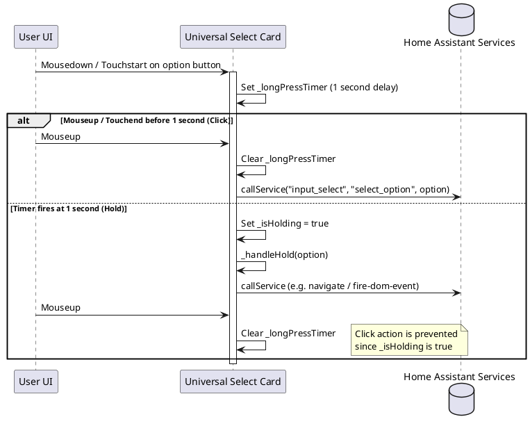

# 🎛️ Universal Select Card

The `universal-select-card` renders options of an `input_select` dropdown entity as segmented inline buttons. It supports custom styling, layout alignments, hold/long-press actions, dynamic state labels, and nested child card features.

---

## ⚙️ Configuration Schema

Below are the configuration parameters for the card. Define these fields in your Lovelace dashboard YAML block:

### Main Card Settings

| Property | Type | Required | Default | Description |
| :--- | :--- | :--- | :--- | :--- |
| `type` | string | **Yes** | — | Must be `custom:universal-select-card`. |
| `entity` | string | **Yes** | — | The entity ID of the target `input_select` (e.g. `input_select.house_mode`). |
| `layout` | string | No | `row` | Button layout alignment. Supported values: `row` (horizontal), `column` (vertical). |
| `show_label` | boolean | No | `true` | Show option description labels beneath icons. |
| `lock_entity` | string | No | — | Binary sensor entity ID. If state is `on`, the buttons are disabled and interaction is locked. |
| `options_order` | array | No | — | Array of strings defining the custom display order of the select options. |
| `options_config` | object | No | — | Key-value dictionary mapping option values to button settings. See [Option Configuration Settings](#option-configuration-settings). |

---

### Option Configuration Settings

You can customize each option button individually inside the `options_config` block:

| Property | Type | Required | Default | Description |
| :--- | :--- | :--- | :--- | :--- |
| `label` | string | No | Option Value | Custom label display string override. |
| `icon` | string | No | `mdi:circle-outline`| Custom button icon override. |
| `color` | string | No | `var(--primary-color)` | Button background color when this option is selected/active. |
| `animation` | string | No | — | Action icon animation class when selected. Supported values: `bounce`, `blink`, `rotating`, `pulse`, `shake`, `float`, `spin_slow`. |
| `active_label_entity` | string | No | — | Entity ID. When active, replaces the label with the formatted state of this entity (e.g., current temperature sensor). |
| `hide_label_if_active` | boolean | No | `false` | Hides the label text when the button is active. |
| `hold_action` | object | No | — | Standard Lovelace action schema executed on holding/long-pressing the button. See [Hold Action Options](#hold-action-options). |
| `features` | array | No | — | List of child custom features rendered within the button tile when active. |

#### Hold Action Options

Configures custom actions (e.g., service calls, navigations, external URLs) triggered by holding the button:

| Property | Type | Required | Default | Description |
| :--- | :--- | :--- | :--- | :--- |
| `action` | string | **Yes** | — | The action type. Supported values: `call-service` (or `perform-action`), `navigate`, `url`, `more-info`, `fire-dom-event`, `none`. |
| `service` | string | No | — | The service identifier to call (e.g. `light.turn_on`). Required if `action` is `call-service`. |
| `data` | object | No | — | Service data parameters to pass to the call. |
| `target` | object | No | — | Service target target parameters (e.g., `entity_id` or `area_id`). |
| `navigation_path` | string | No | — | Dashboard view path to navigate to (e.g. `/lovelace/security`). Required if `action` is `navigate`. |
| `url_path` | string | No | — | External web page URL to open. Required if `action` is `url`. |

---

## 💡 YAML Configuration Example

```yaml
type: custom:universal-select-card
entity: input_select.climate_preset
layout: row
show_label: true
lock_entity: binary_sensor.climate_lock
options_order:
  - Eco
  - Comfort
  - Boost
options_config:
  Eco:
    icon: mdi:leaf
    color: "#4caf50"
    hold_action:
      action: navigate
      navigation_path: /lovelace/energy
  Comfort:
    icon: mdi:sofa
    color: "#2196f3"
    active_label_entity: sensor.living_room_temperature
  Boost:
    icon: mdi:fire
    color: "#ff5722"
    animation: pulse
    features:
      - type: "custom:timer-card-feature"
        entity: timer.boost_duration
```

---

## 🏗️ Architecture & Interaction Flow

The interaction sequence for option click, hold triggers, and card rendering:


