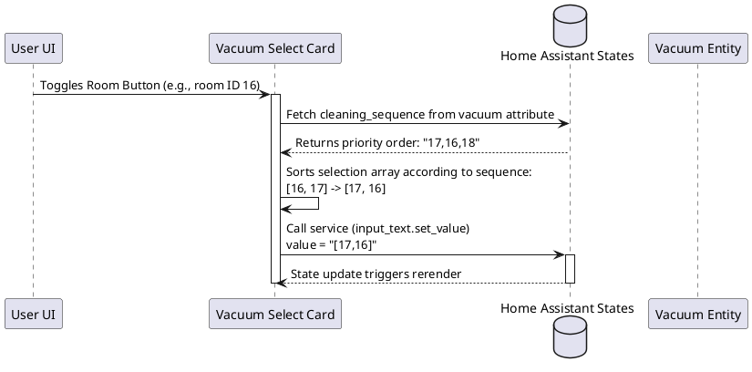

# 🧹 Vacuum Select Card

`vacuum-select-card` renders a clean grid of selectable rooms for coordinating multi-room vacuum cleanings. It reads segment/room information from vacuum attributes, tracks room selection selections in a text helper, sequences the cleaning zones, and applies blink/pulse animations to highlight the active room currently being cleaned.

---

## ⚙️ Configuration Schema

Below are the configuration parameters for the card. Define these fields in your Lovelace dashboard YAML block:

### Main Card Settings

| Property | Type | Required | Default | Description |
| :--- | :--- | :--- | :--- | :--- |
| `type` | string | **Yes** | — | Must be `custom:vacuum-select-card`. |
| `vacuum_entity` | string | **Yes** | — | The entity ID of the vacuum cleaner (e.g. `vacuum.downstairs_roborock`). Must expose `rooms` attribute. |
| `output_entity` | string | **Yes** | — | The entity ID of the helper option tracking selection state (e.g. `input_text.selected_rooms` or `input_select`). Selection is saved as a JSON array string (e.g., `["16","17"]`). |
| `currently_cleaning_entity` | string | No | — | Entity ID containing the ID of the room currently being cleaned (e.g. `sensor.roborock_current_room`). |
| `readonly_entity` | string | No | — | Binary sensor entity ID. If state is `on`, clicking buttons is disabled and the card is locked. |
| `mark_active_room` | string | No | — | Binary sensor entity ID. If state is `on`, enables active room highlighting/animation based on the room state. |
| `mark_animation` | string | No | `none` | Continuous icon animation for the active room being cleaned. Supported: `none`, `spinning`, `pulsing`, `flashing`, `bouncing`, `shaking`, `floating`, `slow_spin`. |
| `mark_animation_background` | string | No | — | Background color code override (e.g., `var(--warning-color)`) applied to the active room button cell. |
| `mark_animation_foreground` | string | No | — | Icon and text color code override applied to the active room button cell. |
| `columns` | number | No | `4` | Number of columns in the room buttons layout grid (from 2 to 6). |
| `show_toggle` | boolean | No | `true` | Display the "Toggle All / Select All" button panel at the bottom of the card. |
| `selection_color` | string | No | `var(--primary-color)` | Button background color applied to room cells when toggled selected. |
| `selection_foreground` | string | No | `white` | Text and icon color applied to room cells when toggled selected. |
| `rooms` | object | No | — | Key-value dictionary mapping individual room IDs (strings) to customized settings. See [Room Customization Options](#room-customization-options). |

---

### Room Customization Options

You can customize each room individually inside the `rooms` configuration block:

| Property | Type | Required | Default | Description |
| :--- | :--- | :--- | :--- | :--- |
| `label` | string | No | Room Name | Display label override for the room. |
| `icon` | string | No | Room Icon | Custom icon override for the room button (e.g. `mdi:bed-double`). |
| `animation` | string | No | `none` | Continuous icon animation class applied to this specific room icon. Supported values: `none`, `spinning`, `pulsing`, `flashing`, `bouncing`, `shaking`, `floating`, `slow_spin`. |
| `disabled` | boolean | No | `false` | If set to `true`, hides the room button from the select grid entirely. |

---

## 💡 YAML Configuration Example

```yaml
type: custom:vacuum-select-card
vacuum_entity: vacuum.downstairs_roborock
output_entity: input_text.selected_clean_zones
currently_cleaning_entity: sensor.roborock_current_room
readonly_entity: binary_sensor.roborock_cleaning_in_progress
mark_active_room: binary_sensor.roborock_active_cleaning
mark_animation: pulsing
mark_animation_background: "var(--warning-color)"
columns: 3
selection_color: "var(--success-color)"
rooms:
  "16":
    label: "Kitchen"
    icon: mdi:silverware-fork-knife
  "17":
    label: "Living Room"
    icon: mdi:sofa
  "18":
    label: "Hallway"
    disabled: true
```

---

## 🏗️ Architecture & Interaction Flow

The interaction sequence for room selection, sorting against the vacuum's sequence sequence priority, and updating HA states:


